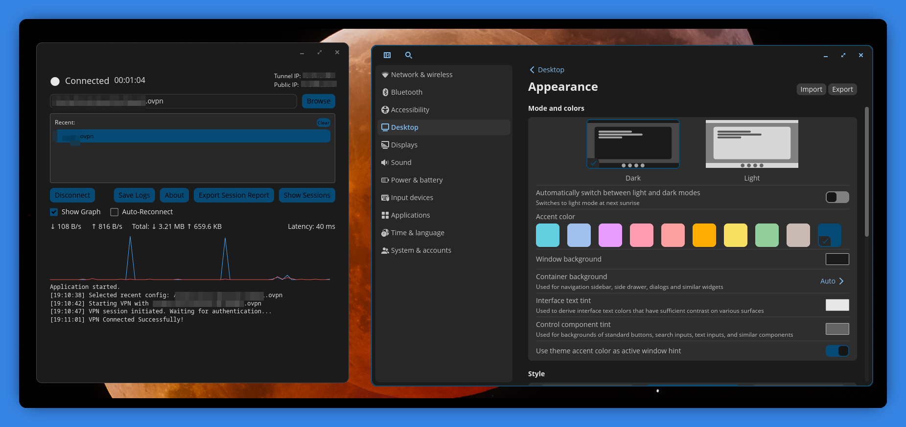

# OpenVPN3 GUI

## ⚠️ **EARLY ALPHA - UNDER ACTIVE DEVELOPMENT** ⚠️

A modern, lightweight GUI for OpenVPN3 built with Rust and the libcosmic framework, designed for seamless integration with COSMIC Desktop Environment.

**Created by:** fonzi  
**Website:** https://fonzi.xyz

## Screenshot



## Features

### Core Functionality
- ✅ **Start/Stop VPN Connections** - Easy one-click connection management
- ✅ **Recent Configs** - Quick access dropdown for recently used VPN configs
- ✅ **SSO Authentication Support** - Interactive browser-based authentication
- ✅ **Session Monitoring** - Continuous status checking during connection


### Additional Features
- 💾 **Save Logs** - Export session logs to timestamped files
- 🔄 **Auto-Reconnect** - Automatically reconnect on disconnect (optional)
- 🔐 **2FA/Challenge Support** - Handle challenge-response authentication
- 🎨 **Native COSMIC Integration** - Built with libcosmic for perfect COSMIC DE integration
- 🌓 **Automatic Theme Switching** - Follows system theme preferences

## Prerequisites

- **COSMIC Desktop Environment** (recommended) or any Wayland/X11 environment
- **OpenVPN3 Client** installed and configured
  ```bash
  sudo apt install openvpn3
  ```
- **Rust** (1.70.0 or higher)
  ```bash
  curl --proto '=https' --tlsv1.2 -sSf https://sh.rustup.rs | sh
  ```
- **Required system development libraries**:
  ```bash
  # On Ubuntu/Pop!_OS/Debian:
  sudo apt install libxkbcommon-dev libfontconfig-dev libfreetype-dev libexpat1-dev pkg-config
  
  # These are required for building libcosmic applications
  # - libxkbcommon-dev: Keyboard handling for Wayland
  # - libfontconfig-dev: Font configuration
  # - libfreetype-dev: Font rendering
  # - libexpat1-dev: XML parsing
  # - pkg-config: Build configuration tool
  ```

## Building

```bash
# Clone the repository
git clone <your-repo-url>
cd openvpn-gui-rust

# Build in release mode
cargo build --release

# Run
cargo run --release
```

## Installation

For system-wide installation:

```bash
# Run the install script
./install.sh
```

This will:
- Build the release version
- Install the binary to `~/.local/bin/openvpn_gui`
- Install the desktop file to `~/.local/share/applications/`
- Update the desktop database

After installation, you can:
- Run `openvpn_gui` from any terminal
- Find "OpenVPN3 GUI" in your application launcher
- The app will appear with proper branding in your dock/taskbar

## Usage

1. **Select Config**: 
   - Click "Browse" to select your `.ovpn` configuration file
   - Or select from the "Recent" dropdown if you've used configs before
2. **Start VPN**: Click "Start VPN" button
3. **Authentication**: 
   - For SSO: A browser window will open automatically
   - For 2FA: Enter your code in the orange banner that appears
4. **Monitor Connection**: Watch real-time stats and the network graph
5. **System Tray**: The tray icon shows connection status (blue=disconnected, green=connected)
6. **Disconnect**: Click "Disconnect" when done

### Recent Configs

The app automatically remembers your last 10 used config files:
- Stored in `~/.config/openvpn-gui/recent_configs.txt`
- Click any recent file to quickly select it
- Click "Clear" to remove all recent configs

## Architecture

```
src/
├── main.rs              # Entry point
├── app.rs               # Application state & logic
├── models.rs            # Data models & messages
├── utils.rs             # Helper functions
├── icon.rs              # Icon generation (shield with lock)
├── tray.rs              # System tray integration (ksni)
├── ui/
│   ├── components.rs    # UI view functions
│   ├── graph.rs         # Network traffic graph
│   └── mod.rs
└── vpn/
    ├── manager.rs       # OpenVPN3 operations
    └── parser.rs        # Output parsing
```

## Known Bugs

1. **Cosmic Dock Issue**: The icon/name will not show in the Cosmic dock unless the app is pinned from the apps menu first
2. **Session State Persistence**: Opening and closing the app will cause it to forget which VPN sessions are active

## Contributing

Contributions welcome! Please feel free to submit issues or pull requests.
